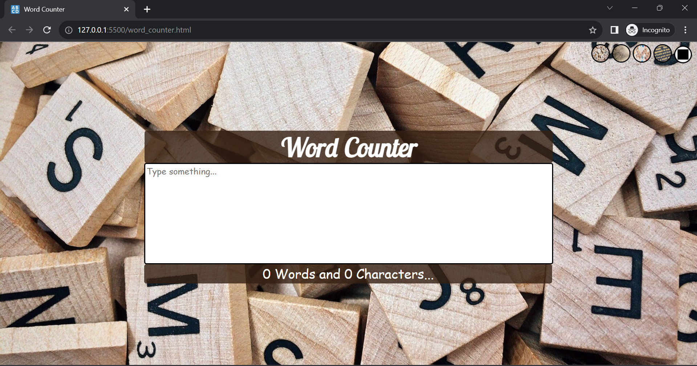

# Word Counter
- HTML-5, CSS-3, Vanilla JS ES-6
### Links
word-counter-ten-sigma.vercel.app

## Table of contents
- [Overview](#overview)
- [Screenshot](#screenshot)
- [Links](#links)
- [Built with](#built-with)
- [Useful resources](#useful-resources)
- [Author](#author)

## Overview
Welcome to my dynamic Word Counter website, expertly crafted using HTML5, CSS3, and Vanilla JavaScript. Seamlessly monitor character and word counts in real-time as you type, catering to the needs of writers, students, and professionals seeking accurate text analysis. Also! With a single click, you can transform your writing environment by selecting background themes from our array of visually appealing options.

### Screenshot
- Default Background

- Background Choice 1

- Background Choice 2

- Background Choice 3

- Colored Background with color of your choice

- Click on color box to get color pallette...

### Built with
- Semantic HTML5 markup
- CSS custom properties
- Flex-box
- Vanilla JS

### Useful resources
- W3schools (https://www.w3schools.com/)
- MDN web Docs (https://developer.mozilla.org/en-US/)

## Author
Priya
- GitHub: (https://github.com/Priya-git21)
- LinkedIn: (https://www.linkedin.com/in/priya-makkar-851973223/)
